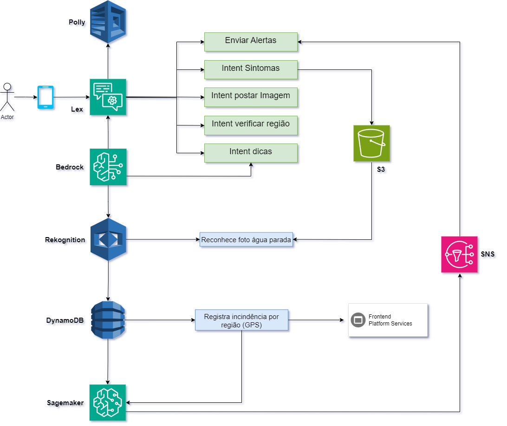

## Aplicativo de Monitoramento de Focos de Dengue usando AWS
 
## Proposta do Projeto:
 
**Descrição**: Um sistema que utiliza inteligência artificial para identificar e monitorar focos de dengue em áreas urbanas por meio da análise de imagens enviadas por usuários. A aplicação visa analisar imagens de locais públicos e privados, como quintais ou terrenos baldios, identificando possíveis focos de água parada onde os mosquitos se reproduzem. Além disso, um chatbot integrado fornecerá orientações preventivas e instruções sobre como eliminar esses focos, ajudando a população a adotar práticas de combate à dengue.

**Escopo Inicial**: Esta versão do projeto é focada no desenvolvimento de um protótipo funcional para a coleta e análise de dados, utilizando ferramentas AWS para processar imagens e interagir com os usuários por meio de um chatbot.

**Impacto e Apelo Social**: A solução busca reduzir a propagação da dengue, uma doença que afeta milhares de pessoas em regiões tropicais. Ao identificar áreas com possíveis focos de mosquito, o sistema contribui para prevenir surtos e promove campanhas de conscientização. O projeto incentiva a colaboração com universidades e organizações públicas, alinhando-se ao objetivo de melhorar a saúde e o bem-estar da população.

## Tecnologias Pretendidas: 

## Arquitetura do Projeto:

 
 ## Responsáveis pelo desenvolvimento:

 | [ Alexander Júnior](https://github.com/alexanderjr02) |  [ Gerson Ramos](https://github.com/gersonlramos) |  [ Jeff Carneiro](https://github.com/j3ffcarneiro) |  [ Lizandra Resende](https://github.com/ResendeLiz) | [ Nathalia Reis](https://github.com/NathaliaOSReis)
| :---: | :---: | :---: | :---: | :---: |